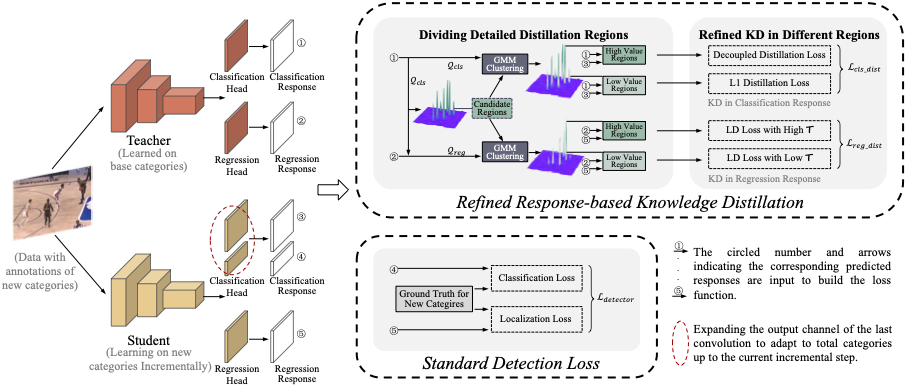

# Class-Incremental Player Detection with Refined Response-based Knowledge Distillation

## Introduction
>Effective player detection in sports broadcast videos is crucial for detailed event analysis. However, current studies heavily rely on static datasets with predefined player categories, limiting their adaptability to continuously emerging player instances from new categories in real-world broadcast scenarios. Additionally, directly applying existing incremental detectors designed for general scenes also faces challenges, such as the lack of benchmarks and restricted performance, rendering incremental player detection an underexplored field. To address these limitations, we propose an innovative knowledge distillation-based class-incremental player detection approach. Our approach introduces a refined response-based knowledge distillation strategy to retain acquired knowledge about previous player categories when learning player instances from new categories. Specifically, we utilize the Gaussian Mixture Model to dynamically segregate high-value and low-value distillation regions within the candidate classification and regression responses. Then, we design a tailored knowledge distillation method for these distinct regions to transfer knowledge effectively. Extensive experiments on various incremental settings of real-world sports competitions demonstrate the effectiveness of our approach, achieving state-of-the-art results and potentially advancing incremental learning research in sports video analysis.

**The code will be made publicly available upon acceptance of the paper.**
